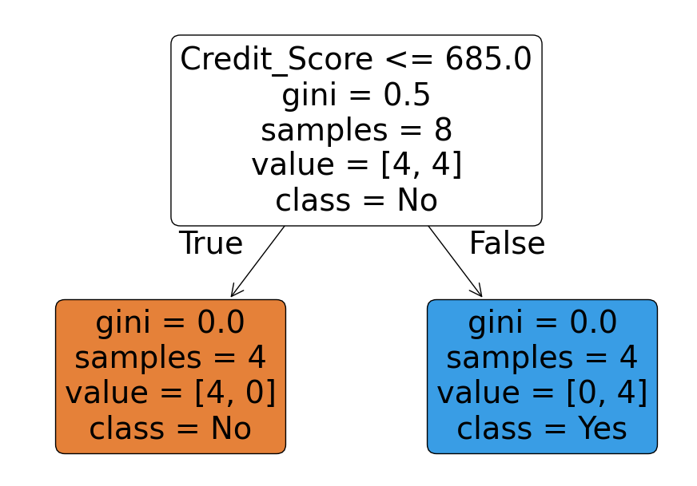

# Loan Approval Prediction using Decision Trees (ML)

This project demonstrates a **machine learning classification system** built with a **Decision Tree Classifier** to support automated loan pre-screening.

The model is designed as a **decision-support tool**, helping financial institutions identify applicants who are more likely to repay loans based on historical data.

---

## 🏦 Business Context

**FinTrust Bank** aims to reduce credit risk and improve operational efficiency by introducing an automated system that can pre-screen loan applicants.

Using historical applicant data, the bank wants to predict whether a loan applicant is likely to **successfully repay a loan** (`Yes / No`) before final human approval.

This system is **not a replacement for human judgment**, but a first-stage filtering tool.

---

## 📊 Dataset Overview

The dataset contains applicant information collected over five years, including:

- **Age**
- **Income Level**
- **Credit Score**
- **Years Employed**
- **Loan Status** (Target variable: Yes / No)

The dataset is split into:
- **85% training data**
- **15% testing data**

---

## 🧠 Machine Learning Approach

This project uses a **Decision Tree Classifier**, chosen because:

- It is interpretable and transparent
- Decision rules are easy to explain to non-technical stakeholders
- It works well for structured, tabular data
- It supports binary classification problems effectively

### Workflow:
1. Feature selection and target encoding
2. Train-test split (85% / 15%)
3. Decision Tree model training
4. Accuracy evaluation (train, test, cross-validation)
5. Visualization of decision rules
6. Simple loan approval automation function

---

## 🌳 Decision Tree Visualization

The diagram below shows the learned decision rules used by the model to classify applicants.

Each node represents:
- A decision rule (e.g. credit score threshold)
- Gini impurity (class purity)
- Number of samples
- Predicted class

This transparency makes the model suitable for **regulated financial environments**.

---

## 📈 Model Performance

- Training accuracy and testing accuracy are evaluated to check for overfitting
- 5-fold cross-validation is used to assess model stability
- Results indicate consistent performance across folds

---

## ⚙️ Automated Loan Screening

A reusable prediction function is included that accepts new applicant data:

- Age  
- Income Level  
- Credit Score  
- Years Employed  

It returns a **human-readable decision**:
- “Yes, candidate qualifies.”
- “No, unfortunately candidate does not qualify.”

This simulates how the model could be integrated into a real loan-processing workflow.

---
# ⚠️ Ethical Considerations

- Automated predictions can introduce bias if training data is biased
- Models should never be the **sole decision-maker**
- Human oversight is required for fairness and accountability
- Transparency and explainability are critical in financial systems

---

## 👤 Author

**Muhammed Uwais Adam**  
Machine Learning | Data Analysis | Decision Systems

